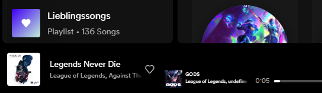

# spicetify-extensions
My extensions created for [Spicetify](https://github.com/khanhas/spicetify-cli) ʕ⁠っ⁠•⁠ᴥ⁠•⁠ʔ⁠っ

## [Upcoming Song:](./upcomingSong/README.md)

Displays the upcoming song near the current song based on the queue.

    
See the final result

    
    

#### How to use:

* No actions necessary.

#### More plugins will be added in the future, stay tuned!

### More:
If you think this repository or any of the plugins are useful, consider giving it a star! ʕ⁠っ⁠•⁠ᴥ⁠•⁠ʔ⁠っ 

If you encounter any issues or want to request a new feature, please [create a new issue](https://github.com/Fl3xm3ist3r/spicetify-extensions/issues/new/choose).

