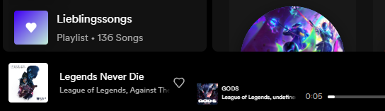

    

<h1 align="center">Spicetify Extensions</h1>

Small extensions for <a href="https://github.com/spicetify/spicetify-cli">Spicetify</a>.

    
    
    

## Available Extension

### [Upcoming Song](upcomingSong/README.md)

Shows the next playable track beside the currently playing song. Select it to skip ahead.

    

## Installation

Install **Upcoming Song** from the Marketplace's **Extensions** tab, or follow the [manual installation guide](https://spicetify.app/docs/advanced-usage/extensions/#installing).

## License

This repository is released under the [MIT License](LICENSE).

ʕ⁠っ⁠•⁠ᴥ⁠•⁠ʔ⁠っ

